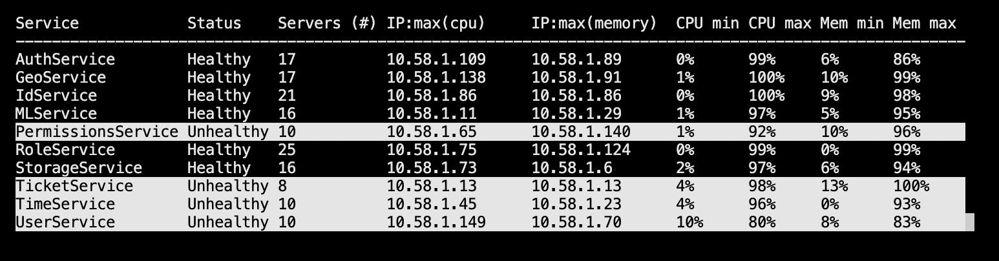
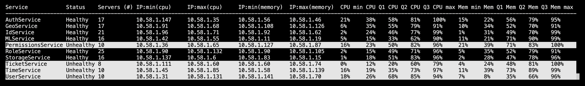

# CPX Utils CLI

CLI tool for fetching information about servers and services from CPX API.

## Usage

There are two modes of operation:
- `snapshot` retrieves information one single time and writes to standard output as specified;
- `watch` continuously fetches information, locking and updating the screen as long as desired.

### Snapshot mode

It is ideal for integration with other tools or for obtaining a quick overview of CPX servers and services.

The output format can be configured for `table` (easy to view), `csv`, or `json`.

The level of detail can be `summary` in which only high level is displayed, or `full` in order to retrieve a full list of servers and services, as well as theirs details.
- `summary` is focused on service health
- `full` is focused on individual servers, displaying redundant information about services hosted

Assuming CPX API is available on `localhost:8080`, the following are usage examples:

**Table**

```
$ cpx_utils --host localhost --port 8080 snapshot                     
Service            Status    Servers (#) IP:min(cpu)     IP:max(cpu)     IP:min(memory)  IP:max(memory)  CPU min CPU Q1 CPU Q2 CPU Q3 CPU max Mem min Mem Q1 Mem Q2 Mem Q3 Mem max 
-----------------------------------------------------------------------------------------------------------------------------------------------------------------------------------
AuthService        Healthy   17          10.58.1.46      10.58.1.89      10.58.1.28      10.58.1.81      7%      37%    54%    88%    99%     1%      23%    36%    87%    97%     
GeoService         Healthy   17          10.58.1.122     10.58.1.115     10.58.1.44      10.58.1.115     3%      15%    46%    72%    94%     0%      22%    33%    62%    78%     
IdService          Healthy   21          10.58.1.40      10.58.1.123     10.58.1.116     10.58.1.40      2%      24%    48%    75%    98%     1%      43%    62%    75%    100%    
MLService          Healthy   16          10.58.1.63      10.58.1.79      10.58.1.93      10.58.1.79      1%      12%    46%    65%    98%     3%      22%    46%    76%    100%    
PermissionsService Unhealthy 10          10.58.1.140     10.58.1.150     10.58.1.47      10.58.1.87      2%      4%     34%    68%    92%     6%      11%    22%    82%    85%     
RoleService        Healthy   25          10.58.1.18      10.58.1.101     10.58.1.72      10.58.1.10      12%     30%    53%    81%    100%    2%      31%    48%    79%    93%     
StorageService     Healthy   16          10.58.1.6       10.58.1.43      10.58.1.73      10.58.1.69      3%      42%    61%    79%    96%     22%     41%    75%    89%    99%     
TicketService      Unhealthy 8           10.58.1.135     10.58.1.50      10.58.1.50      10.58.1.74      22%     31%    59%    86%    98%     1%      29%    52%    68%    94%     
TimeService        Unhealthy 10          10.58.1.37      10.58.1.110     10.58.1.38      10.58.1.58      13%     33%    60%    79%    95%     16%     45%    61%    91%    98%     
UserService        Unhealthy 10          10.58.1.141     10.58.1.31      10.58.1.121     10.58.1.52      6%      16%    52%    71%    79%     7%      18%    75%    90%    94% 
```

**CSV**

```
$ cpx_utils--host localhost --port 8080 snapshot -f csv
service,status,total_servers,ips,ip_cpu_min,ip_cpu_max,ip_memory_min,ip_memory_max,cpu_min,cpu_p25,cpu_p50,cpu_p75,cpu_max,memory_min,memory_p25,memory_p50,memory_p75,memory_max
"PermissionsService","Healthy","10","['10.58.1.127', '10.58.1.36', '10.58.1.47', '10.58.1.65', '10.58.1.140', '10.58.1.150', '10.58.1.87', '10.58.1.128', '10.58.1.12', '10.58.1.130']","10.58.1.65","10.58.1.87","10.58.1.128","10.58.1.140","2.0","23.75","42.5","80.0","92.0","5.0","12.5","34.0","61.25","66.0"
"StorageService","Healthy","16","['10.58.1.1', '10.58.1.99', '10.58.1.6', '10.58.1.53', '10.58.1.73', '10.58.1.82', '10.58.1.5', '10.58.1.136', '10.58.1.15', '10.58.1.137', '10.58.1.114', '10.58.1.43', '10.58.1.39', '10.58.1.4', '10.58.1.69', '10.58.1.83']","10.58.1.69","10.58.1.114","10.58.1.5","10.58.1.43","4.0","9.5","39.5","72.25","85.0","0.0","24.5","36.0","81.0","93.0"
"AuthService","Healthy","17","['10.58.1.89', '10.58.1.107', '10.58.1.145', '10.58.1.25', '10.58.1.81', '10.58.1.84', '10.58.1.88', '10.58.1.35', '10.58.1.46', '10.58.1.56', '10.58.1.61', '10.58.1.57', '10.58.1.147', '10.58.1.28', '10.58.1.95', '10.58.1.9', '10.58.1.109']","10.58.1.9","10.58.1.57","10.58.1.35","10.58.1.46","9.0","17.0","30.0","75.5","93.0","0.0","20.0","37.0","71.5","93.0"
"GeoService","Healthy","17","['10.58.1.122', '10.58.1.26', '10.58.1.148', '10.58.1.115', '10.58.1.144', '10.58.1.126', '10.58.1.108', '10.58.1.67', '10.58.1.59', '10.58.1.94', '10.58.1.33', '10.58.1.20', '10.58.1.119', '10.58.1.68', '10.58.1.44', '10.58.1.138', '10.58.1.91']","10.58.1.26","10.58.1.148","10.58.1.138","10.58.1.91","2.0","26.5","46.0","77.5","99.0","18.0","34.0","61.0","84.0","93.0"
"TicketService","Healthy","8","['10.58.1.74', '10.58.1.60', '10.58.1.104', '10.58.1.50', '10.58.1.111', '10.58.1.13', '10.58.1.113', '10.58.1.135']","10.58.1.60","10.58.1.111","10.58.1.104","10.58.1.13","11.0","44.25","74.0","86.75","89.0","4.0","10.0","24.0","34.5","77.0"
"IdService","Healthy","21","['10.58.1.133', '10.58.1.120', '10.58.1.64', '10.58.1.71', '10.58.1.86', '10.58.1.78', '10.58.1.142', '10.58.1.14', '10.58.1.116', '10.58.1.92', '10.58.1.123', '10.58.1.51', '10.58.1.30', '10.58.1.96', '10.58.1.117', '10.58.1.24', '10.58.1.62', '10.58.1.16', '10.58.1.40', '10.58.1.112', '10.58.1.125']","10.58.1.125","10.58.1.78","10.58.1.30","10.58.1.117","2.0","16.5","39.0","70.0","100.0","1.0","12.5","28.0","57.5","97.0"
"MLService","Healthy","16","['10.58.1.79', '10.58.1.55', '10.58.1.66', '10.58.1.106', '10.58.1.17', '10.58.1.19', '10.58.1.11', '10.58.1.134', '10.58.1.103', '10.58.1.93', '10.58.1.118', '10.58.1.42', '10.58.1.3', '10.58.1.76', '10.58.1.63', '10.58.1.29']","10.58.1.3","10.58.1.19","10.58.1.17","10.58.1.134","11.0","30.0","57.5","77.25","82.0","6.0","27.5","55.0","86.0","98.0"
"TimeService","Healthy","10","['10.58.1.139', '10.58.1.38', '10.58.1.2', '10.58.1.85', '10.58.1.32', '10.58.1.58', '10.58.1.23', '10.58.1.110', '10.58.1.45', '10.58.1.37']","10.58.1.23","10.58.1.85","10.58.1.58","10.58.1.2","20.0","37.75","70.0","85.0","91.0","3.0","21.0","46.0","72.5","98.0"
"RoleService","Healthy","25","['10.58.1.102', '10.58.1.7', '10.58.1.8', '10.58.1.72', '10.58.1.41', '10.58.1.100', '10.58.1.22', '10.58.1.75', '10.58.1.146', '10.58.1.34', '10.58.1.54', '10.58.1.18', '10.58.1.49', '10.58.1.132', '10.58.1.21', '10.58.1.105', '10.58.1.27', '10.58.1.97', '10.58.1.90', '10.58.1.101', '10.58.1.10', '10.58.1.48', '10.58.1.129', '10.58.1.80', '10.58.1.124']","10.58.1.75","10.58.1.146","10.58.1.27","10.58.1.10","3.0","24.0","50.0","81.0","95.0","4.0","18.5","41.0","58.5","98.0"
"UserService","Healthy","10","['10.58.1.52', '10.58.1.70', '10.58.1.31', '10.58.1.77', '10.58.1.98', '10.58.1.121', '10.58.1.149', '10.58.1.141', '10.58.1.143', '10.58.1.131']","10.58.1.141","10.58.1.98","10.58.1.77","10.58.1.141","3.0","22.5","44.5","79.5","93.0","3.0","14.75","34.0","63.75","92.0"
```

**JSON**

```
$ cpx_utils --host localhost --port 8080 snapshot -f json | jq .
[
  {
    "service": "GeoService",
    "status": "Healthy",
    "total_servers": "17",
    "ips": "['10.58.1.138', '10.58.1.108', '10.58.1.148', '10.58.1.115', '10.58.1.122', '10.58.1.67', '10.58.1.144', '10.58.1.126', '10.58.1.91', '10.58.1.33', '10.58.1.119', '10.58.1.68', '10.58.1.94', '10.58.1.44', '10.58.1.26', '10.58.1.20', '10.58.1.59']",
    "ip_cpu_min": "10.58.1.108",
    "ip_cpu_max": "10.58.1.122",
    "ip_memory_min": "10.58.1.33",
    "ip_memory_max": "10.58.1.126",
    "cpu_min": "2.0",
    "cpu_p25": "36.5",
    "cpu_p50": "72.0",
    "cpu_p75": "84.5",
    "cpu_max": "99.0",
    "memory_min": "5.0",
    "memory_p25": "33.0",
    "memory_p50": "61.0",
    "memory_p75": "84.5",
    "memory_max": "92.0"
  },
...
```

### Watch mode

It is useful for visually monitoring servers and services during debugging, deployment, or disaster recovery situations.

The displayed information can be `simple`, where only high level numbers are informed, of `complete` which contains a few more columns.

This mode will lock the screen and update according to the refresh period provided.

Unhealthy services (those with fewer than two servers) are highlighted by having the line colors inverted.

Assuming CPX API is available on `localhost:8080`, the following are usage examples:

**Simple view (default)**

```
$ cpx_utils --host localhost --port 8080 watch
```

```
  Service            Status    Servers (#) IP:max(cpu)     IP:max(memory)  CPU min CPU max Mem min Mem max
  ---------------------------------------------------------------------------------------------------------
  AuthService        Healthy   17          10.58.1.35      10.58.1.61      0%      100%    8%      98%
  GeoService         Healthy   17          10.58.1.59      10.58.1.59      12%     100%    10%     97%
  IdService          Healthy   21          10.58.1.92      10.58.1.24      2%      98%     1%      97%
  MLService          Healthy   16          10.58.1.106     10.58.1.103     9%      96%     1%      94%
  PermissionsService Unhealthy 10          10.58.1.127     10.58.1.128     35%     97%     14%     98%     
  RoleService        Healthy   25          10.58.1.72      10.58.1.75      2%      84%     11%     93%
  StorageService     Healthy   16          10.58.1.114     10.58.1.137     5%      94%     2%      90%
  TicketService      Unhealthy 8           10.58.1.60      10.58.1.135     1%      92%     8%      99%     
  TimeService        Unhealthy 10          10.58.1.23      10.58.1.45      4%      94%     8%      91%     
  UserService        Unhealthy 10          10.58.1.141     10.58.1.98      2%      95%     21%     85%  
```

Here is a screenshot example altering to 10 the minimum number of servers to be considerate healthy:



**Complete view**

```
$ cpx_utils --host localhost --port 8080 watch -m complete
```

```
  Service            Status    Servers (#) IP:min(cpu)     IP:max(cpu)     IP:min(memory)  IP:max(memory)  CPU min CPU Q1 CPU Q2 CPU Q3 CPU max Mem min Mem Q1 Mem Q2 Mem Q3 Mem max
  -----------------------------------------------------------------------------------------------------------------------------------------------------------------------------------
  AuthService        Healthy   17          10.58.1.9       10.58.1.25      10.58.1.84      10.58.1.9       6%      17%    46%    57%    76%     10%     48%    64%    83%    89%
  GeoService         Healthy   17          10.58.1.59      10.58.1.148     10.58.1.59      10.58.1.44      7%      24%    46%    70%    95%     1%      32%    46%    82%    96%
  IdService          Healthy   21          10.58.1.92      10.58.1.142     10.58.1.40      10.58.1.133     12%     32%    58%    81%    92%     1%      26%    47%    72%    90%
  MLService          Healthy   16          10.58.1.42      10.58.1.11      10.58.1.103     10.58.1.118     7%      40%    63%    77%    91%     1%      22%    54%    83%    91%
  PermissionsService Unhealthy 10          10.58.1.12      10.58.1.87      10.58.1.87      10.58.1.47      10%     18%    26%    60%    91%     5%      34%    40%    77%    92%     
  RoleService        Healthy   25          10.58.1.75      10.58.1.102     10.58.1.27      10.58.1.105     0%      32%    48%    79%    100%    6%      38%    65%    78%    98%
  StorageService     Healthy   16          10.58.1.73      10.58.1.136     10.58.1.43      10.58.1.137     8%      49%    68%    79%    99%     0%      17%    38%    61%    92%
  TicketService      Unhealthy 8           10.58.1.113     10.58.1.74      10.58.1.13      10.58.1.135     5%      28%    54%    80%    98%     36%     45%    51%    81%    86%     
  TimeService        Unhealthy 10          10.58.1.32      10.58.1.38      10.58.1.37      10.58.1.58      5%      14%    51%    71%    100%    8%      24%    37%    75%    100%    
  UserService        Unhealthy 10          10.58.1.121     10.58.1.149     10.58.1.121     10.58.1.131     6%      30%    58%    74%    85%     20%     36%    58%    76%    82%
```

Here is a screenshot example altering to 10 the minimum number of servers to be considerate healthy:



## Building and Installing

For development, please create a virtual environment and activate it:

```
$ python3 -m venv env
$ source env/bin/activate
```

Install the required external libraries:

```
(env) $ pip install --upgrade pip
(env) $ pip install -r requirements-dev.txt
```

Please run the tests, build, and install as follows:

```
(env) $ pytest
(env) $ python setup.py build
(env) $ python setup.py install
```

Alternatively, using make, the tests can be triggered by:

```
(env) $ make test
```

The new distribution can be built and installed by:

```
(env) $ make build
(env) $ make install
```

## Next steps

1. Introduce retry/fallback mechanisms for the case CPX API is not available.
2. Integration with statsd for enabling data collection, analysis, and take actions upon reaching thresholds.
3. Improve appearance and features of watch mode. For instance: sort columns or quit on keypresses.
4. Fix some inconsistencies between use of IPv4 and IPv6; the monitor will get distorted for IPv6 addresses larger than 15 characters (it can go up to 39 characters).
5. The monitor is still unstable. Sometimes it is necessary to quit (CTRL+C) and start it again before is really starts refreshing.
6. Although it is a small application, it is over engineered and the logs are not optimal, at the moment they are only useful for debugging.
7. The `SerivesStatistics` class is particularly bad designed and requires improvement.
8. It would be important to have an "inverted" version of the `snapshot` mode where services running on the same server are summarized in order to understand how each server is being shared in case that happens.